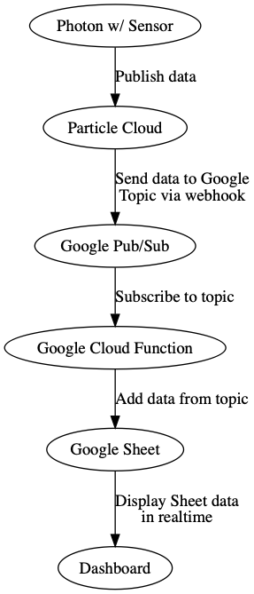
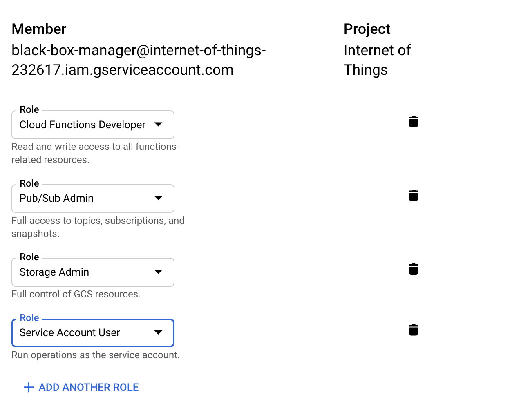

# Cloud Integration

The data for the Black Box is ultimately stored in a Google Sheet.
The data flow for that looks a little something like this:

As you can see, a Photon with a Sensor publishes data to the Particle Cloud.
The Particle Cloud sends that data to a Google Pub/Sub topic, which in turn
passes along the data to a Google Cloud Function.
The Cloud Function then appends the data to a Google Sheet.
Finally, a dashboard is configiured that displays the Google Sheet in real time.

It is a lot of moving parts to view the data from the Photon.
To simplify this, [Terraform](https://www.terraform.io/) is used to create all
the Google Cloud infrastructure.
All that is required is a Google Cloud Project with a Service Account with the following roles:

* Pub/Sub Admin
* Cloud Functions Developer
* Storage Admin
* Service Account User

Once the service account is created, the credential file or key needs to be downloaded in JSON format.
The should be placed in the same `Cloud` directory next to the `cloud.tf` file with the name `account.json`.

## Terraform

Requires version 0.11

Note that Terraform 0.12 is not supported due to configuration language changes.

## Service Account

A service account is required with a JSON based key.
Permissions required:

Download the key as a JSON file and place in this directory named `account.json`.