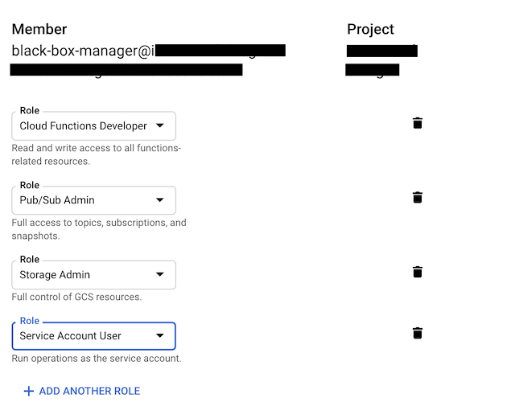

# Cloud Integration

The data for the Black Box is ultimately stored in a Google Sheet.
The data flow for that looks a little something like this:

<div style="text-align:center">
  
</div>

As you can see, a Photon with a Sensor publishes data to the Particle Cloud.
The Particle Cloud sends that data to a Google Pub/Sub topic, which in turn
passes along the data to a Google Cloud Function.
The Cloud Function then appends the data to a Google Sheet.
Finally, a dashboard is configiured that displays the Google Sheet in real time.

It is a lot of moving parts to view the data from the Photon.
To simplify this, [Terraform](https://www.terraform.io/) is used to create all the Google Cloud infrastructure.
The file `cloud.tf` defines what the Pub/Sub Topic and Cloud Function, along with other pieces to make that happen,
such as a bucket to store the Function code in.
The following snippet defines the Topic and adds the Particle Service Account as a publisher:

```terraform
resource "google_pubsub_topic" "topic" {
  name = "${var.topic_name}"
}

# Add the Particle service account as a Pub/Sub publisher to the topic
resource "google_pubsub_topic_iam_binding" "publisher" {
  topic = "${google_pubsub_topic.topic.name}"
  role  = "roles/pubsub.publisher"

  members = [
    "serviceAccount:particle-public@particle-public.iam.gserviceaccount.com",
  ]
}
```

The next snippet defines the Cloud Function.
The code for the function is stored in a bucket, also managed via Terraform:

```terraform
resource "google_cloudfunctions_function" "function" {
  name                  = "${var.function_name}"
  available_memory_mb   = 128
  timeout               = 60
  runtime               = "go111"
  source_archive_bucket = "${google_storage_bucket_object.function_object.bucket}"
  source_archive_object = "${google_storage_bucket_object.function_object.name}"

  event_trigger = {
    event_type = "google.pubsub.topic.publish"
    resource   = "${google_pubsub_topic.topic.name}"
  }

  entry_point = "Run"
}
```

To apply the Terraform configuration, [install Terraform locally](https://www.terraform.io/downloads.html).
Be sure to use version 0.11 and **not** 0.12 as the configuration syntax has changed.
This does required a Google Cloud Project with a Service Account with the following roles:

* Pub/Sub Admin
* Cloud Functions Developer
* Storage Admin
* Service Account User

The following image shows an example of setting the roles for the Service Account:

<div style="text-align:center">
  
</div>

Once the service account is created, the credential file or key needs to be downloaded in JSON format.
The should be placed in the same `Cloud` directory next to the `cloud.tf` file with the name `account.json`.
Then copy or rename the `example_override.tf` to `override.tf`.
Edit this file replace `my-project-1234` with the Google Cloud project id.
The `override.tf` should look like this with `cool-project-23433` being the project id:

```terraform
variable "project" {
  default = "cool-project-23422"
}
```

The directory should look something like this:

```shell
$ ls -l
total 288
-rw-r--r--  1 jshimek  staff    1511 Apr 20 15:08 README.md
-rw-r--r--@ 1 jshimek  staff    2364 Apr 19 11:42 account.json
-rw-r--r--  1 jshimek  staff    2759 Apr 19 22:18 cloud.tf
drwxr-xr-x  5 jshimek  staff     160 Apr 20 15:05 docs
-rw-r--r--  1 jshimek  staff      53 Apr 20 15:21 example_override.tf
-rw-r--r--  1 jshimek  staff      62 Apr 19 22:27 override.tf
-rwxr-xr-x  1 jshimek  staff     138 Apr 20 15:05 pdf.sh
drwxr-xr-x  3 jshimek  staff      96 Apr 19 12:38 src
```

At this point, the Terraform can be run with the following commands:

```shell
terraform init
terraform plan
terraform apply
```

The [first command initializes Terraform](https://www.terraform.io/docs/commands/init.html) in the current directory.
The [second command creates an execution plan](https://www.terraform.io/docs/commands/plan.html) in order to setup the Google Cloud infrastructure.
The [third command applies the changes](https://www.terraform.io/docs/commands/apply.html) needed to setup the Google Cloud infrastructure.
After this completes, the Google Cloud project should have the Topic and Function required for the BlackBox project.