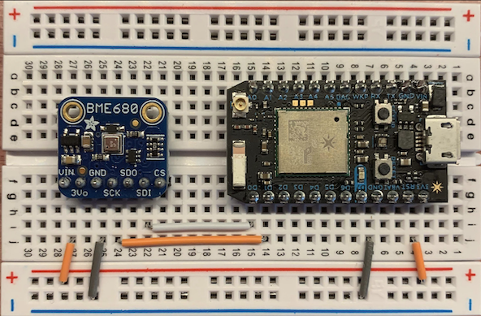
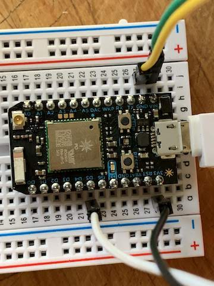

## Introduction

The Building Black Box is collaborative art installation with [Tesia Kosmalski](http://tesiakosmalski.net/).
Tesia has an art studio in the [2010 Hennepin](http://first-first.com/places/2010) building which is an old General Mills R&D facility.
She asked me a couple months ago about helping with a project that uses an Arduino.
The project needed to involve the history of the building and be something that would be
entertaining and informational to visitors during [Art-A-Whirl](https://nemaa.org/art-a-whirl/).
We discussed a couple options can settled the current project, a Building Black Box.

I learned from Tesia that General Mills was involved in creating one of the first flight recorders in the United States.
It was called the [Ryan Flight Recorder](https://en.wikipedia.org/wiki/Flight_recorder#US_designs).
This was a project that General Mills worked in in collaboration with Professor James J. "Crash" Ryan at the University of Minnesota.
The General Mills lab that worked on this project was located in the same building that Tesia's studio is in.
The flight recorder eventually evolved into what is presently known as the Black Box in an aircraft.

With this information, Tesia wanted at create something that will demonstrate a Black Box.
We decided to have three sensors placed throughout the building with a computer displaying the current status in her studio.
While there is a more involved in an actual black box, we felt that recording the environment within the building to a good analog to a real black box.
The sensor we found, the [BME680](https://www.adafruit.com/product/3660), reads temperature, humidity, barometric pressure, and air quality.
Since we don't expect there to be catastrophic events in building during Art-A-Whirl,
the graphs on the dashboards will not be very interesting.
To help this, a 4th device will be setup by the display in the studio with a button.
When the button is pressed, a catastrophe will be simulated in one or more of the devices with sensors.

This complete project can be found on [Github](https://github.com/varikin/blackbox)

## Sensors

A core concept to the project is collecting data about the environment.
This is done using a [Particle Photon](https://docs.particle.io/datasheets/wi-fi/photon-datasheet/) connected to the BME680 sensor mentioned above.
According the [datasheet for the BME680](https://cdn-shop.adafruit.com/product-files/3660/BME680.pdf),
the BME680 can connected to the Photon using either the I2C bus or SPI.
I chose to use I2C because example code with the library available through Particle uses I2C.
The following table describes how to wire the sensor to the Photon:

| BME680 | Particle Photon |
| --- | ---
| VIN | 3v3
| GND | GND
| SCK | D1
| SDI | D0

The following diagram illustrates how the wire up the sensor and the Photon:

<div style="text-align:center">
  
</div>

The next photo shows the actual sensor and the Photon wired together on a breadboard:
<div style="text-align:center">
  
</div>

One unfortunate thing with the BME680 sensor is that it without the header pins connected so it had no way to connect to the breadboard out the box.
This posed some difficulty in using the sensor since I had no experience with soldering.
Since I want to continue playing with electronics like this, I decided to learn to solder.
I bought a [Hakko FX-888D](http://www.hakko.com/english/products/hakko_fx888d_set.html) soldering iron and some solder.
I also bought a pack of perfboards and spare header pins to practice on,
similar to [this](https://www.adafruit.com/product/2670) and [this](https://www.adafruit.com/product/2822) to practice on.
I found this video by Adafruit on [how to solder](https://www.youtube.com/watch?v=QKbJxytERvg) which was very helpful.
After soldering a couple dozen pins, I felt comfortable soldering header pins onto the sensor which was successful.

At this point, I was ready to actually write the code to read data off the sensor and publish it to the Particle Cloud.
Luckily, there is a [library for the BME680](https://github.com/adafruit/Adafruit_BME680) sensor for use with an Arduino.
Particle provides a maintained version of this which can be added via the Install Library action in the Particle Web IDE or the Particle Workbench in VS Code.
The sensor needs to be initialized like this:

```cpp
#include "Adafruit_BME680.h"

#define SEALEVELPRESSURE_HPA (1013.25)

Adafruit_BME680 bme; // I2C

double temperatureInC = 0;
double relativeHumidity = 0;
double pressureHpa = 0;
double gasResistanceKOhms = 0;


void setup() {
  if (!bme.begin()) {
    Particle.publish("Log", "Could not find a valid BME680 sensor, check wiring!", PRIVATE);
  } else {
    Particle.publish("Log", "bme.begin() success =)", PRIVATE);
    // Set up oversampling and filter initialization
    bme.setTemperatureOversampling(BME680_OS_8X);
    bme.setHumidityOversampling(BME680_OS_2X);
    bme.setPressureOversampling(BME680_OS_4X);
    bme.setIIRFilterSize(BME680_FILTER_SIZE_3);
    bme.setGasHeater(320, 150); // 320*C for 150 ms
  }
```

This was taken from the example provided with the library.
I am not sure what all the options used to initialize the `bme` object mean, but they work.
After this, the main loop in the code needs to read the values off the sensor.

```cpp
void loop() {
  if (! bme.performReading()) {
    Particle.publish("Log", "Failed to perform reading :(", PRIVATE);
  } else {
    temperatureInC = bme.temperature;
    relativeHumidity = bme.humidity;
    pressureHpa = bme.pressure / 100.0;
    gasResistanceKOhms = bme.gas_resistance / 1000.0;

    String data = String::format(
      "{"
        "\"temperature\":%.2f,"
        "\"humidity\":%.2f,"
        "\"pressure\":%.2f,"
        "\"airQuality\":%.2f"
      "}",
      temperatureInC,
      relativeHumidity,
      pressureHpa,
      gasResistanceKOhms
    );

    Particle.publish("sensor-data", data, PRIVATE);
  }
  delay(10 * 1000);
}
```

The values are then published as an event named `sensor-data` to the Particle cloud as JSON.

### Air Quality Index

Before I go any further, I need to talk about the Air Quality Index provided by the BME680.
There is a lot of factors that go into the air quality based on VOC such as ethane, isoprene, ethanol, acetone, carbon monoxide, and more.
The datasheet for the sensor describes a lot of complex chemical aspects to what it can sense and how it exposes that data.
That is beyond my understanding of chemistry.
Luckily, the sensor also also provides a simple linear scale of the Air Quality Index.

| Air Quality Index | Air Quality |
| --- | --- |
| 0 – 50 | Good |
| 51 - 100 | Average |
| 101 – 150 | Little bad |
| 151 – 200 | Bad |
| 201 – 300 | Worse |
| 301 – 500 | Very bad |

These ratings are based on the guidelines issued by the German Federal Environmental Agency,
exceeding 25 mg/m3 of total VOC leads to headaches and further neurotoxic impact on health.

## Photon Functions

As mentioned before, the device with the sensor needs to simulate a catastrophe.
This is accomplished using a [Particle Function](https://docs.particle.io/reference/device-os/firmware/photon/#particle-function-).
A Particle Function allows me to define a function on the device that can be invoked via POSTing to Particles API.
The following code demonstrates this:

```cpp
const uint32_t CATASTROPHE_LENGTH = 120;
uint32_t catastropheTimer = 0;
int introduceCatastrophe(String cmd);
double getMultiplier();
double calculateCatastrophe(double multiplier, double value);
void deviceNameHandler(const char *topic, const char *data);

void setup() {
  // Register the catastrophe function
  Particle.function("catastrophe", introduceCatastrophe);
  // Setup the BME sensor as before
  // ...
}

int introduceCatastrophe(String cmd) {
  // Don't reset the timer if already active
  if (catastropheTimer > 0) {
    return 0;
  }

  catastropheTimer = Time.now() + CATASTROPHE_LENGTH;
  return 1;
}
```

The first part, `Particle.function("catastrophe", introduceCatastrophe)`, registers the function `introduceCatastrophe` with the Particle Cloud.
At this point, that function can be invoked on the Photon by POSTing to Particle's API.
The following Curl command will do so with the device id and access token:

```shell
curl "https://api.particle.io/v1/devices/${DEVICE_ID}/catastrophe" -d access_token="${ACCESS_TOKEN}"
```

The device ID can be found on the [Particle My Devices](https://console.particle.io/devices) page.
The access token can be found in the [Particle Web IDE settings](https://build.particle.io/build/new) page.
For more information on authenticating calls to the Particle Cloud API, please read the [authentication](https://docs.particle.io/reference/device-cloud/api/#authentication) documentation.

When that function is invoked, a timer is set; really, it sets when the catastrophe ends.
In the loop that reads and publishes the sensor data, the data is modified until the current time is after the catastrophe timer.
The exact modification is very simple at the moment just to demonstrate that it works.
I will work with Tesia before Art-A-Whirl on implementing something that is interesting and hopefully realistic.
For example, we may want to simulate the first couple minutes of a fire.
Right now, we don't know what the data for that should look like.

## Catastrophe Button

### Button Hardware

Simulating a catastrophe is done with a separate Photon connected a button.
The chosen button is [24mm LED arcade button](https://www.adafruit.com/product/3430).
There is not a datasheet for the button that I could find, but it is pretty simple.
Has has four pins, two for the momentary switch and two to power the LED.
According to the description on Adafruit's website, the button is lit with two LEDs in parallel, each with a 1K resistor.
The LED requires 5V with a draw of 10mA.
The Photon only provides 3.3V, but according the datasheet, if powered via USB, the V<sub>in</sub> pin will output about 4.8V.
I was able to use this to power the LEDs in the button, but that means I am not able to easily control the lights.
They are either on or off, depending on whether the Photon has power or not.
The diagram below is a poor representation of how wire the button and the Photon together.
There wasn't a part in Fritzing for the LED arcade button, so I show a simple arcade button and a single LED.
The LED is meant to represent the pins on the arcade button for the LEDs in the button.

<div style="text-align:center">
  
</div>

Since the pins are not marked, I used a multimeter to determine which two are connected to the switch.
The other two then had to be for LEDs.
The photos below show the button connected to the Photon.


<div style="text-align:center">
  
</div>

This image shows the pins.
The top two pins, which are offset, read the state of the switch.
The bottom two pins power the LEDs.
In the table below, the button pins are labeled according the colors of the wires that I used.
These colors don't mean anything other than they were available to use at the time.

| Button Pin | Photon Pin | Purpose |
| --- | --- | --- |
| Black | 3v3 | Switch |
| White | D5 | Switch |
| Green | V<sub>in</sub> | LED |
| Yellow | Gnd | LED |

Note that either ground pin on the Photon works with the LEDs.
I just chose the one next the V<sub>in</sub> to keep paired wires near each other.


<div style="text-align:center">
  
</div>
<div style="text-align:center">
  
</div>

The above two images show the wires from the button connected to the breadboard
and the button lit up when the Photon is powered.

### Software for the Button

When the button is pressed, it should inform another Photon with sensors to simulate a catastrophe.
It was described above how to trigger this on other Photons by POSTing to the Particle Cloud API.
Unfortunately, the capabilities on the Photon to make HTTP calls over TLS are are very limited.
TLS is needed to make an HTTP request to a secure domain using `https`.
There appears to be several unofficial libraries to support TLS, but they are lacking in understandable documentation and examples.
My solution was to publish to Particle Cloud when the button is pressed.
That event stream is published to a Google Pub/Sub Topic via a webhook.
A Google Cloud Function then subscribes to this Pub/Sub Topic and make the HTTP request to the Particle Cloud API.
Below is the code to detect when the button is pressed and to publish that state.

```cpp
int momPin = D5;
int previousMomState = 0;

// Setup the device with the momentary switch pin in the right mode.
void setup() {
  pinMode(momPin, INPUT_PULLDOWN);
}

// Main loop, check the switch state
void loop() {

  int momState = digitalRead(momPin);

  // Only act if the state changed from the last run.
  if (previousMomState != momState) {
    previousMomState = momState;
    if (momState == 1) {
      Particle.publish("simulate-catastrophe", String(momState), 60, PRIVATE);
    }
  }
}
```

## Cloud Integration

The data for the Black Box is ultimately stored in a Google Sheet.
The data flow for that looks a little something like this:

<div style="text-align:center">
  
</div>

A Photon with a sensor publishes data to the Particle Cloud.
At the moment, there is just a single Photon with a sensor, but for Art-A-Whirl, there will be three.
But that does not change the data flow or operation of an individual Photon.
The Particle Cloud sends the sensor data to a Google Pub/Sub Topic, which in turn
passes along the data to a Google Cloud Function.
The Cloud Function then appends the data to a Google Sheet.
Finally, a dashboard is configured that displays the Google Sheet in real time.
Technically, at the moment, a dashboard has not been configured because existing solutions do not meet our needs.
They either offer too limited control over what is graphed or they do not update fast enough.

The other Photon with the button publishes to the Particle Cloud when the button is activated.
That event is sent to a different Google Pub/Sub Topic.
Another Cloud Function subscribes this second Topic.
When this Function runs, it randomly selects one of the Photons with a sensor
and makes an HTTP request to the Particle Function API for that device.

With so many parts to the Google Cloud integration,
I opted to use [Terraform](https://www.terraform.io/) is used to create and update all the Google Cloud infrastructure.
The file `cloud.tf` defines both Pub/Sub Topics and Cloud Functions, along with other pieces to make that happen,
such as a bucket to store the Function code in.
The following snippet defines the Topic for the sensor data and adds the Particle Service Account as a publisher:

```terraform
resource "google_pubsub_topic" "sensor_data_topic" {
  name = "${var.sensor_data_topic}"
}

# Add the Particle service account as a Pub/Sub publisher to the topic
resource "google_pubsub_topic_iam_binding" "sensor_data_publisher" {
  topic = "${google_pubsub_topic.sensor_data_topic.name}"
  role  = "roles/pubsub.publisher"

  members = [
    "serviceAccount:particle-public@particle-public.iam.gserviceaccount.com",
  ]
}
```

The Topic for the button activation is the same, except with a different name.

The next snippet defines the Cloud Function for sensor data.
The code for the Function is stored in a bucket, also managed via Terraform:

```terraform
resource "google_cloudfunctions_function" "sensor_data_function" {
  name                  = "${var.sensor_data_function}"
  available_memory_mb   = 128
  timeout               = 60
  runtime               = "go111"
  source_archive_bucket = "${google_storage_bucket_object.sensor_data_function_object.bucket}"
  source_archive_object = "${google_storage_bucket_object.sensor_data_function_object.name}"

  event_trigger = {
    event_type = "google.pubsub.topic.publish"
    resource   = "${google_pubsub_topic.sensor_data_topic.name}"
  }
  environment_variables = {
    SHEET_ID = "${var.sheet_id}"
  }

  entry_point = "Run"
}
```

The Function for simulating a catastrophe is the same except for the name and references.

To apply the Terraform configuration, [install Terraform locally](https://www.terraform.io/downloads.html).
Be sure to use version 0.11 and **not** 0.12 as the configuration syntax has changed.
This does required a Google Cloud Project with a Service Account with the following roles:

* Pub/Sub Admin
* Cloud Functions Developer
* Storage Admin
* Service Account User

The following image shows an example of setting the roles for the Service Account:

<div style="text-align:center">
  
</div>

Once the service account is created, the credential file or key needs to be downloaded in JSON format.
The should be placed in the same `Cloud` directory next to the `cloud.tf` file with the name `account.json`.
Then copy or rename the `example_override.tf` to `override.tf`.
Edit this file and set the following defaults to your values:

* project
* sheet_id
* device_ids
* particle_access_token

The `override.tf` should look something like this, but with your values:

```terraform
variable "project" {
  default = "cool-project-23422"
}

variable "sheet_id" {
  default = "abcdefghijklmnopqrstuvwxyz--1234567890"
}


variable "device_ids" {
    default = "23432543232432432432"
}

variable "particle_access_token" {
  default = "234324jkfdpsa45u32jklfnmdsiaeo3"
}
```

The Google Sheet ID can be found in the URL to the Sheet like this.
Mine starts with `1c` and ends with `Uo`:

<div style="text-align:center">
  
</div>

The device IDs will the Particle Device IDs for all the Photons with sensors.
These can be found on the [Particle Console](https://console.particle.io/devices).
If more than one Photon is being used, they should be listed in a comma delimited string like this:

```terraform
variable "device_ids" {
    default = "23432543232432432432,6424626324532464,345432453245432543"
}
```

The Particle Access Token can be found in the [Particle Web IDE settings](https://build.particle.io/build/new) page.

The directory should look something like this:

```shell
$ ls -l
total 288
-rw-r--r--  1 jshimek  staff    1511 Apr 20 15:08 README.md
-rw-r--r--@ 1 jshimek  staff    2364 Apr 19 11:42 account.json
-rw-r--r--  1 jshimek  staff    2759 Apr 19 22:18 cloud.tf
drwxr-xr-x  5 jshimek  staff     160 Apr 20 15:05 docs
-rw-r--r--  1 jshimek  staff      53 Apr 20 15:21 example_override.tf
-rw-r--r--  1 jshimek  staff      62 Apr 19 22:27 override.tf
-rwxr-xr-x  1 jshimek  staff     138 Apr 20 15:05 pdf.sh
drwxr-xr-x  3 jshimek  staff      96 Apr 19 12:38 src
```

At this point, the Terraform can be run with the following commands:

```shell
terraform init
terraform plan
terraform apply
```

The [first command initializes Terraform](https://www.terraform.io/docs/commands/init.html) in the current directory.
The [second command creates an execution plan](https://www.terraform.io/docs/commands/plan.html) in order to setup the Google Cloud infrastructure.
The [third command applies the changes](https://www.terraform.io/docs/commands/apply.html) needed to setup the Google Cloud infrastructure.
After this completes, the Google Cloud project should have the Topic and Function required for the BlackBox project.

Once all this is complete, two webhooks will need to be created in the Particle Console so that the data is published to Google Pub/Sub.
This done on the [Particle Console Integrations](https://console.particle.io/integrations) page.
Click *New Integration* and choose *Google Cloud Platform*.
The next page lists instructions to create Google Cloud account, project, and Pub/Sub Topic with the correct permissions.
If the Terraform ran successfully, this should be done.
Click through to the next screen and set the event name to be `sensor-data`
and the Topic to be `projects/<cool-project-1234>/topics/black-box-sensor-data`.
You will need to replace `<cool-project-1234>` with your project name.
Alternatively, you can get the complete Topic name from the Google Pub/Sub console.
Set the device to *Any* so that all the data from Photons with sensors is published.
After that, create a second Google Cloud integration to publish the button state.
The event name for that integration should be `simulate-catastrophe`.
The Topic should be `projects/<cool-project-1234>/topics/black-box-catastrophe`, again replacing the project name with your project name.
The device can be set to either *Any* or the specific Photon with the button.

### Google Sheet

The Function will fail to append data to the Google Sheet still at this point.
The default Service Account for the Google Project needs to added to the Sheet with *Edit* permissions, like this:

<div style="text-align:center">
  
</div>

That image also shows that layout of the Google Sheet with the following columns:

* Time of the event
* Device name
* Temperature
* Humidity
* Barometric Pressure
* Air Quality

### Google Cloud Functions

The Cloud Function is written in [Go](https://golang.org/) which is a [supported language](https://cloud.google.com/functions/docs/concepts/go-runtime) for Cloud Functions.
Error handling has been removed from all the following code snippets to make the more succinct.
Please reference the actual code to see the error handling.

#### Handling Sensor Data

The following Function reads the data from the Pub/Sub Topic with the sensor data and appends it to the Google Sheet:

```go
func Run(ctx context.Context, m PubSubMessage) error {
  logger := NewCloudFunctionLogger()
  timestamp, err := getTimestamp(m.Attributes)

  // Get the sheet id from the environment
  sheetID := os.Getenv("SHEET_ID")

  // Read the event off the data
  event, err := DecodeSensorEvent(m.Data)

  // Append the event to sheet
  AppendEvent(ctx, sheetID, timestamp, event)

  logger.log("Appended data to the sheet")

  return nil
}
```

This should be pretty self-explanatory, but it is worth calling out the main sections.
First, the published time for the event is read off the `Attributes` of the Pub/Sub messages that triggered the Function.
The timestamp is more complicated than expected.
Particle includes the published time on the event in ISO 8601 format.
It looks something like this: `2019-04-23T15:32.238Z`.
Google Sheets does not natively recognize this as a date and time.
To handle this, the date and time is converted in the Function to a format that Google Sheets recognizes.
This is accomplished by parsing the given date and time into a `Time` object and then formatting in a different way like this:

```go
func getTimestamp(attributes map[string]string) (string, error) {
  timestamp, err := time.Parse("2006-01-02T15:04:05.999Z", attributes["published_at"])
  return timestamp.Format("01/02/2006 3:03 PM"), nil
}
```

By the way, Go has an odd way to specific [date and time formats](https://golang.org/pkg/time/#Parse).
Go reads a date and time format using an example format with a specific date and time, *Mon Jan 2 15:04:05 -0700 MST 2006*.

Next, the Sheet ID that was defined in Terraform is available to the Function as an environment variable.
Then the sensor data is decoded into a usable format within the Function.
Here is how it is decoded:

```go
// SensorEvent is the payload within the Pub/Sub event data.
type SensorEvent struct {
  Temperature float64 `json:"temperature"`
  Humidity    float64 `json:"humidity"`
  Pressure    float64 `json:"pressure"`
  AirQuality  float64 `json:"airQuality"`
  Device      string  `json:"device"`
}

// DecodeSensorEvent decodes the raw sensor event and converts to a SensorEvent struct
func DecodeSensorEvent(data []byte) (*SensorEvent, error) {
  var event SensorEvent
  json.Unmarshal(data, &event)
  return &event, nil
}
```

An astute observer will notice that the device name is provided in the message.
It turns out that when Particle sends the event to Google Pub/Sub, the device name is not included.
Instead, the device ID  is included, which is not as readable as the name.
To address this, the code for the Photon was updated to include the device name in the published data.
The device name was obtained using code provided in the [Particle device name](https://docs.particle.io/reference/device-os/firmware/photon/#get-device-name) documentation.

Finally, the data is appended to the Google Sheet using the [Google Sheets API v4 library for Go](https://godoc.org/google.golang.org/api/sheets/v4).
This is done in the `AppendEvent` method in the Cloud Function.
The call `sheets.NewService(ctx)` determines that this is running in a Google Cloud runtime and
automatically authenticates to Google Sheets using the default Service Account for the project.
Hence, why we gave access to that Service Account in the Google Sheet.
If this was not running in Google Cloud, authenticating with Google Sheets would be more complicated.

```go
// AppendEvent appends a SensorEvent to a Google Sheet.
func AppendEvent(ctx context.Context, sheetID string, timestamp string, event *SensorEvent) error {
  sheetService, err := sheets.NewService(ctx)

  values := []interface{}{timestamp, event.Device, event.Temperature, event.Humidity, event.Pressure, event.AirQuality}
  var valueRange sheets.ValueRange
  valueRange.Values = append(valueRange.Values, values)
  _, err = sheetService.Spreadsheets.Values.Append(sheetID, "A1", &valueRange).ValueInputOption("USER_ENTERED").Do()
  return nil
}
```

#### Simulating the Catastrophe

The following Function is invoked by new data in the Pub/Sub Topic.
It doesn't use that data, it just uses the new data as a trigger.
It reads the device IDs from an environment variable and chooses one randomly.
Finally, it submits a `POST` request to `https://api.particle.io/v1/devices/<DEVICE_ID>/catastrophe`.

```go
// Run is the entry point into the Function.
// The pub/sub message is not needed, it is just a trigger.
func Run(ctx context.Context, _ interface{}) error {
  logger := NewCloudFunctionLogger()

  // Get the access token for Particle
  accessToken := os.Getenv("PARTICLE_ACCESS_TOKEN")

  // Get the list of devices that could be acted upon
  rawDeviceIDs := os.Getenv("DEVICE_IDS")
  deviceIDs := strings.Split(rawDeviceIDs, ",")

  // Select one device randomly
  seed := rand.NewSource(time.Now().UnixNano())
  random := rand.New(seed)
  index := random.Intn(len(deviceIDs))
  deviceID := deviceIDs[index]

  // Post to the Particle Cloud for the device
  api := fmt.Sprintf("https://api.particle.io/v1/devices/%s/catastrophe", deviceID)
  http.PostForm(api, url.Values{
    "access_token": {accessToken},
  })

  logger.log("Simulated catastrophe on device %s", deviceID)
  return nil
}
```

## Dashboards

At this time, there is no dashboard to display all this data in real-time.
I tried a couple different solutions, such as [Dasharoo](https://www.dasheroo.com/) and [Google Data Studio](https://datastudio.google.com/).
The problems I encountered were either limited capabilities in the graphs and not having the graphs updated in a timely manner.
I have a feeling that I will need to write my own dashboard for Art-A-Whirl.

## Conclusion

A complete IoT solution as a lot of pieces to it.
Each piece takes time and trial and error, but in the end, is not difficult.
The is the combination of all of the pieces that make this this hard.
In this case, a lot of research was one on understanding how the BME680 sensor connects to the Photon, both physically and via the code.
And then there was a brief detour into learning how to solder so the sensor could actually be attached to a breadboard.
Once the Photon was publishing data to the Photon Cloud, it was just a matter of connecting that to a Google Sheet.
Having a software background and experience with Google Cloud, this was a lot easier.
Setting up Terraform to manage the Google Cloud Infrastructure was a huge boon.
Every time I needed needed to change something with the Pub/Sub Topic or update the Google Cloud Function,
I just had to re-run `terraform apply`.
Getting the solution to manage Google Cloud Functions via Terraform did involve reading several StackOverflow questions and issues in Github.
But in the end, the solution with storing the code in a file a bucket with the hash of the zip file in the filename worked great.
Once everything was working, it was pretty easy to iterate on both the Photon and the Cloud integration.

I am disappointed that I was not able to get a dashboard working yet, but there is still time for that at Art-A-Whirl, along with polishing this up.
Each Photon with a sensor should powered by a battery that can last three days.
I have not yet measured how many amps it draws to figure what is needed for the battery capacity.
Also, the Photons will need reliable wifi throughout the 2010 Hennepin building.
Hopefully the City of Minneapolis wifi can be used, but if not, I may need to work with other artists in the building near where each Photon is placed.
The specifics of what *simulating a catastrophe* means will definitely need to change to be more realistic, but all the plumbing is in place to trigger it.
Finally, the Photons need to be in a nice case.
I will be working with Tesia to 3D print cases that fit our needs.